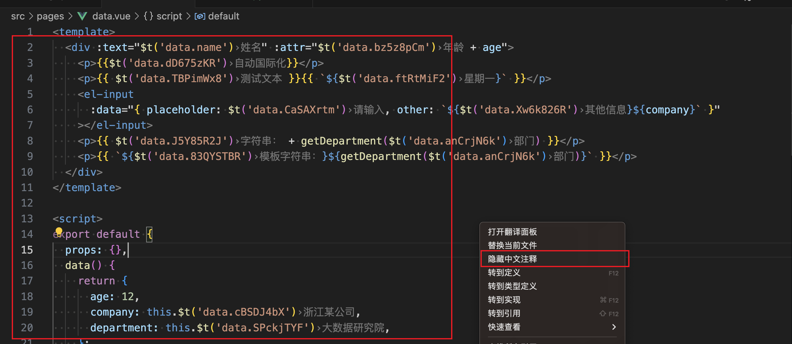

## 介绍
在日常开发过程中需要频繁地配置vue-i18n文本，这极大的影响了开发效率，同时增加了开发者的心智负担。

这是一款辅助开发者快速编写与替换Vue I18n的工具。

    

## 主要能力

* **支持Vue/Vue3（选项式 API/组合式 API）文件的翻译和替换**
* **支持JavaScript/TypeScript文件的翻译和替换**
* **支持自动显示中文注释，同时支持手动开启和关闭**
* **支持批量导入导出中文模板**
* **支持批量一键替换所选目录下所有文件**

## 如何使用
  **✨自动显示中文注解**

**注意：前提条件是正确配置i18n目录，如何配置见下方**

  **✨批量导入导出和替换**

  **✨翻译文件**
  可以通过右键打开或右上方  按钮打开翻译面板

  **✨设置i18n文件目录**
  首次会自动弹出设置，也可通过 **⌘/Ctrl+Shift+P** 查找 **vue-i18n-op** 设置

  **✨保存翻译**

  **✨替换文件**

## 感谢
如果插件给您带来便利,欢迎 star 或赞赏哦~❤️
